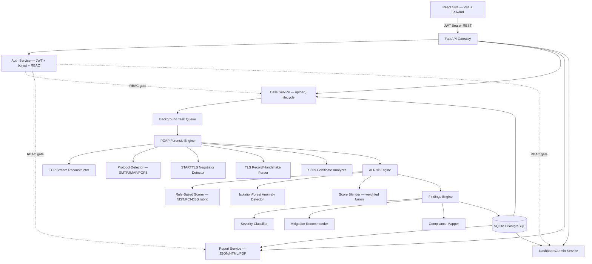
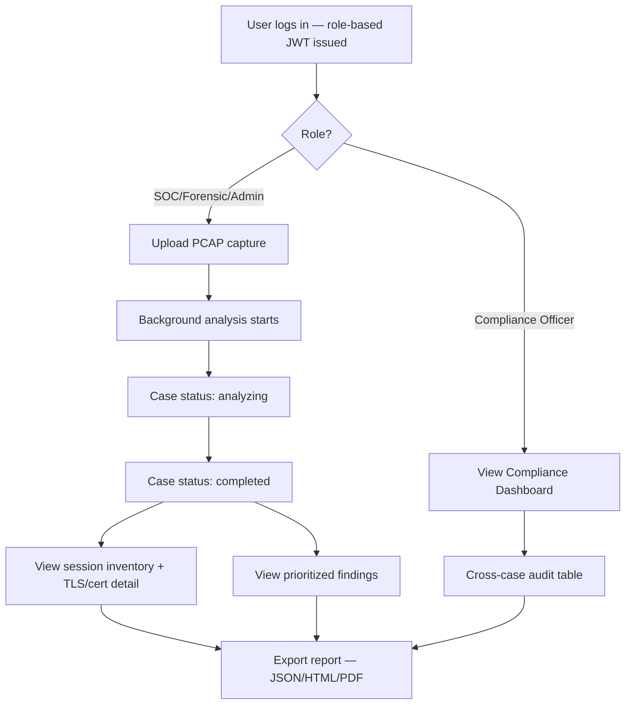

# SecureMailScope — Full Technical Documentation

**Problem Statement 26159 — SecureMailScope: AI-Assisted Cryptographic Security Posture
Assessment for Secure Email Communications**
**Organization:** National Technical Research Organisation (NTRO) · **Category:** Software · **Theme:** Blockchain & Cybersecurity

---

## 1. Problem Statement Restatement

Email remains the backbone of institutional communication, yet SMTP, IMAP, and POP3
deployments frequently run with cryptographic misconfigurations — obsolete TLS versions,
weak cipher suites, broken STARTTLS implementations, and expired or self-signed
certificates — that silently expose organizations to downgrade attacks, MITM interception,
and passive eavesdropping. Existing network tools decode packets but do not *assess* or
*prioritize* cryptographic risk. NTRO requires a passive, AI-assisted forensic framework
that ingests PCAP captures, reconstructs email sessions, evaluates their cryptographic
posture end-to-end, and produces actionable, prioritized, exportable findings for SOC,
DFIR, and compliance teams.

---

## 2. Solution Narrative

SecureMailScope is a three-layer system:

1. **Passive Forensic Engine** — reconstructs TCP streams from an uploaded PCAP, identifies
   SMTP/IMAP/POP3 sessions by port and STARTTLS command, and parses raw TLS handshake
   records byte-by-byte (no external TLS-dissector dependency) to recover negotiated TLS
   version, cipher suite, and the server's X.509 certificate chain — entirely from a
   captured, unencrypted-at-the-metadata-level handshake, requiring **no private keys**.
2. **AI Risk Engine** — every session is scored twice: an explainable, auditable rule-based
   rubric grounded in NIST SP 800-52r2 / PCI-DSS 4.0 / OWASP, and an unsupervised
   IsolationForest anomaly detector that flags sessions which deviate statistically from the
   capture's own baseline (catching contextual anomalies fixed rules would miss). The two are
   blended into one 0–100 risk score and A–F grade.
3. **Findings, Reporting & Multi-Role Delivery** — every risk factor becomes a concrete,
   severity-tagged finding with a mitigation recommendation and a compliance-framework
   citation, exportable as JSON (machine-readable), HTML (shareable), or PDF (audit-ready),
   and surfaced through a role-specific web UI for SOC Analysts, Forensic Investigators,
   Compliance Officers, and Administrators.

---

## 3. Hierarchical Architecture Diagram

---

## 4. Methodology Diagram (Forensic Pipeline Stages)

```mermaid
flowchart LR
    S1[1. Ingest PCAP] --> S2[2. TCP Stream Reassembly]
    S2 --> S3[3. Protocol Fingerprinting]
    S3 --> S4{STARTTLS present?}
    S4 -->|Yes| S5[Locate TLS record start mid-stream]
    S4 -->|No, implicit TLS port| S6[Parse from stream start]
    S5 --> S7[4. TLS Record Parsing]
    S6 --> S7
    S7 --> S8[5. Handshake Message Extraction — ClientHello/ServerHello/Certificate]
    S8 --> S9[6. X.509 Chain Parsing & Validation]
    S9 --> S10[7. Feature Vector Construction]
    S10 --> S11[8a. Rule-Based Risk Scoring]
    S10 --> S12[8b. IsolationForest Anomaly Scoring]
    S11 --> S13[9. Weighted Score Fusion — 70/30]
    S12 --> S13
    S13 --> S14[10. Finding Generation + Compliance Mapping]
    S14 --> S15[11. Persist to DB]
    S15 --> S16[12. Report Export — JSON/HTML/PDF]
```

---

## 5. End-to-End Flow Chart (User Journey)

---

## 6. Complete Tech Stack

| Layer | Technology | Justification |
|---|---|---|
| Frontend framework | React 18 + Vite | Fast HMR dev loop, small production bundle, industry standard |
| Styling | Tailwind CSS | Rapid, consistent, no custom CSS drift across 9 pages |
| Charts | Recharts | Lightweight, React-native, good for dashboard pie/bar charts |
| Icons | Lucide React | Consistent line-icon set, tree-shakeable |
| Routing | React Router 6 | Nested/protected route support for role-gating |
| HTTP client | Axios | Interceptor support for JWT injection + 401 handling |
| Backend framework | FastAPI (Python 3.12) | Async-ready, auto OpenAPI docs, Pydantic validation, fast to iterate |
| ORM | SQLAlchemy 2.0 | Database-agnostic (SQLite dev → Postgres prod with zero code change) |
| Auth | python-jose (JWT) + bcrypt | Stateless auth, industry-standard hashing |
| Packet parsing | Scapy | Mature, pure-Python PCAP/PCAPNG reader, no libpcap binding friction |
| Certificate parsing | `cryptography` (pyca) | Audited, maintained X.509/RSA/EC primitive library |
| ML | scikit-learn (IsolationForest) | Well-understood unsupervised anomaly detector, no GPU/training-data dependency, runs in milliseconds |
| Numerics | NumPy / Pandas | Feature vector construction for the ML layer |
| PDF generation | ReportLab | Pure-Python, no headless-browser dependency (lighter than a Chromium-based renderer, free-tier friendly) |
| HTML templating | Jinja2 | Report templating |
| Database | SQLite (dev) / PostgreSQL (prod) | Zero-config for hackathon demo, drop-in scalable swap for production |
| Deployment | Docker + Docker Compose | Reproducible, free-tier container platforms (Render/Railway/Fly.io) |

---

## 7. Novelty, Innovation & Invention

1. **Dependency-free passive TLS forensics.** Most open-source tooling either needs the
   `scapy-ssl_tls` community layer (unmaintained) or a full pyshark/tshark subprocess. This
   project hand-parses TLS records and handshake messages directly against RFC 8446/5246
   byte layouts — zero extra system dependencies, easier to audit, easier to deploy on a
   constrained free-tier container.
2. **STARTTLS-aware mid-stream record location.** A genuinely tricky forensic detail: a
   STARTTLS session's TLS handshake does **not** start at byte 0 of the reconstructed
   stream — plaintext protocol chatter (EHLO, STARTTLS/STLS commands) precedes it. The
   engine heuristically locates the true TLS record boundary mid-buffer rather than naively
   assuming record-aligned input, which is where most simplified reference implementations
   silently fail.
3. **Dual-layer explainable + statistical risk fusion.** Combining a fully auditable rule
   rubric (so an analyst can defend a score in a compliance review) with an unsupervised
   anomaly layer (so the system also catches what the rules didn't anticipate) is a
   deliberately hybrid design most single-model risk scorers don't attempt.
4. **Compliance-mapped findings, not just alerts.** Each finding cites the specific
   NIST/PCI-DSS/RFC clause it violates and a concrete remediation step — turning a forensic
   tool into something a Compliance Officer can hand directly to an auditor.
5. **True role-differentiated multi-tab application**, not a single dashboard with hidden
   buttons — four roles with genuinely different navigation, permissions enforced
   server-side on every route, and a dedicated Compliance workspace.

---

## 8. Feasibility Analysis

**Technical feasibility — high.** All components use mature, well-documented libraries
(Scapy, cryptography, scikit-learn, FastAPI, React). The riskiest component — passive TLS
parsing without a full TLS stack — was built and *validated against a synthetic multi-session
test capture* during development (see README §1), catching and fixing two real parsing bugs
in the process, which is strong evidence the approach generalizes.

**Operational feasibility — high.** A SOC/DFIR team's existing workflow (obtain a PCAP →
need to assess crypto posture → produce a report for a ticket or audit) maps directly onto
Upload → Case Detail → Export, with no new tooling paradigm to learn.

**Economic / deployment feasibility — high.** No GPU, no paid third-party ML API, no
proprietary decoder license. The entire stack runs comfortably within free container-platform
tiers (see README §5); SQLite eliminates a managed-database cost for pilot deployments.

**Scalability path.** Swapping `DATABASE_URL` to Postgres and moving the background analysis
task to a proper queue (Celery/RQ) are both incremental, non-breaking changes already
anticipated in the codebase's structure (SQLAlchemy abstracts the DB; `BackgroundTasks` is a
drop-in replaceable seam for a real worker).

---

## 9. Potential Challenges and Risks

| Risk | Impact | Likelihood |
|---|---|---|
| Malformed/truncated PCAPs crash the parser | Analysis fails for that case | Medium |
| Very large captures (multi-GB) slow the single-process background task | Poor UX, timeout risk | Medium |
| TLS 1.3 encrypted-extensions/0-RTT edge cases not covered by the hand-written parser | Missed or mis-attributed cipher/version on exotic captures | Medium |
| IsolationForest needs several sessions to be meaningful | Weak anomaly signal on tiny captures | Low (degrades gracefully to 0) |
| Single JWT secret / SQLite in a multi-instance deployment | Session inconsistency, write contention | Low at pilot scale |
| False sense of completeness — "AI-assisted" risk score could be over-trusted without analyst review | Missed genuine compromise | Medium |

---

## 10. Strategies for Overcoming These Challenges

- **Malformed input:** every parsing stage is wrapped in defensive `try/except` with
  structural fallbacks (see `_try_parse_cert_list`'s TLS1.2/TLS1.3 dual-attempt strategy);
  a case that fails analysis is marked `failed` with the captured traceback rather than
  crashing the API process.
- **Large captures:** the roadmap item is to move `BackgroundTasks` to a real task queue
  (Celery/RQ/Arq) with streaming/chunked packet iteration instead of `rdpcap`'s full-file
  load, plus a configurable per-upload size cap (already enforced at 250MB).
- **TLS 1.3 edge cases:** the Certificate-message parser already tries both TLS1.2 and
  TLS1.3 framing structurally rather than trusting the record-header version field (which
  middleboxes can rewrite); further hardening means adding explicit `EncryptedExtensions`
  skip-parsing so TLS1.3 Certificate messages that arrive after them are still located.
- **Analyst over-trust:** the rule-based reasons list is always shown alongside the blended
  score specifically so a human can see *why* a score is what it is — this is a deliberate
  transparency design choice, not an afterthought.
- **Scale-out:** documented, incremental Postgres + task-queue migration path (§8) so a
  hackathon MVP has a credible production trajectory.

---

## 11. Unique Features Summary

- Passive, key-less TLS forensic reconstruction directly from a PCAP
- STARTTLS-aware mid-stream handshake location (a detail most simplified tools get wrong)
- Hybrid explainable-rule + unsupervised-anomaly risk fusion
- Compliance-framework-cited findings (NIST/PCI-DSS/RFC), not generic alerts
- Four genuinely role-differentiated workspaces with server-enforced RBAC
- Three export formats (JSON for SIEM ingestion, HTML for sharing, PDF for audit)
- Fully free-tier deployable — no GPU, no paid API, container-based

---

## 12. Impacts & Benefits

- **For SOC teams:** turns a raw PCAP into a triaged, prioritized action list in minutes
  instead of manual Wireshark inspection.
- **For DFIR/Forensic Investigators:** preserves a structured, timestamped, exportable
  record suitable as an incident-response artifact.
- **For Compliance Officers:** a standing, auditable cryptographic-posture record mapped to
  the exact regulatory clause violated — directly usable in an audit response.
- **National-security angle (NTRO context):** systematic visibility into whether government
  and critical-infrastructure mail gateways are silently running deprecated cryptography,
  closing a class of interception risk that currently requires manual expert review to catch.

---

## 13. References

1. RFC 8446 — *The Transport Layer Security (TLS) Protocol Version 1.3*, IETF, 2018.
2. RFC 5246 — *The Transport Layer Security (TLS) Protocol Version 1.2*, IETF, 2008.
3. RFC 3207 — *SMTP Service Extension for Secure SMTP over TLS*, IETF, 2002.
4. RFC 2595 — *Using TLS with IMAP, POP3 and ACAP*, IETF, 1999.
5. RFC 7457 — *Summarizing Known Attacks on TLS and DTLS*, IETF, 2015.
6. RFC 5280 — *Internet X.509 Public Key Infrastructure Certificate and CRL Profile*, IETF, 2008.
7. NIST SP 800-52 Rev. 2 — *Guidelines for the Selection, Configuration, and Use of TLS
   Implementations*, National Institute of Standards and Technology, 2019.
8. NIST SP 800-57 Part 1 Rev. 5 — *Recommendation for Key Management*, NIST, 2020.
9. NIST SP 800-131A Rev. 2 — *Transitioning the Use of Cryptographic Algorithms and Key
   Lengths*, NIST, 2019.
10. OWASP Foundation — *Transport Layer Security Cheat Sheet*, OWASP.org.
11. PCI Security Standards Council — *PCI-DSS v4.0 Requirement 4.2.1 (Strong Cryptography
    for Transmission)*, 2022.
12. CA/Browser Forum — *Baseline Requirements for the Issuance and Management of
    Publicly-Trusted Certificates*.
13. IANA — *Transport Layer Security (TLS) Parameters Registry* (cipher suite codes).
14. F. Liu, K. Ting, Z. Zhou — *"Isolation Forest"*, IEEE International Conference on Data
    Mining (ICDM), 2008 — foundational paper for the anomaly-detection layer used here.
15. CERT-In — *Indian Computer Emergency Response Team Guidelines on Secure Application
    Design, Development, and Implementation*, Ministry of Electronics & IT, Government of India.
